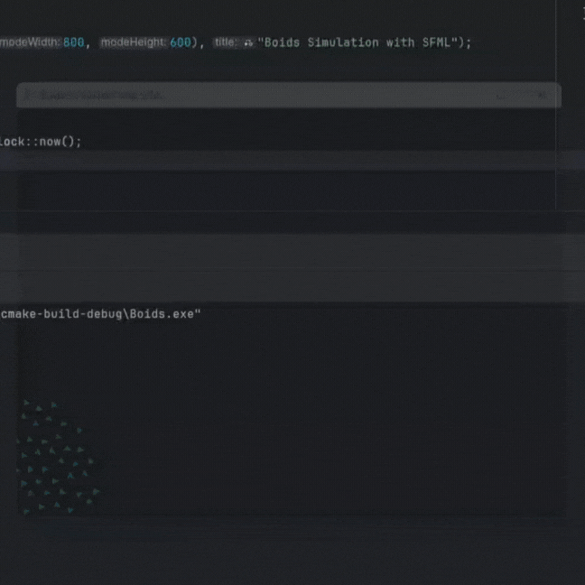

# Boids

The Boids algorithm, developed by Craig Reynolds in 1986, simulates the collective behavior of flocks of birds or schools of fish. It is based on three simple rules:

1. **Separation**: Avoiding collisions with nearby individuals.
2. **Alignment**: Matching the direction of neighbors.
3. **Cohesion**: Moving toward the group’s center.

These local interactions create realistic group dynamics without centralized control. Boids has applications in animations, robotics, and drone swarms, where autonomous coordination and adaptive, resilient behavior are essential.

## Example Simulation

Below is a demonstration of the Boids algorithm in action. It simulates the movement of 50 boids using the SFML library:

This example showcases how the algorithm achieves realistic group dynamics through simple local rules and demonstrates the potential of SFML for visualizing complex simulations.

## References

Additional insights and tutorials on implementing the Boids algorithm can be found at:
- [Boids Algorithm by Hunter Adams](https://vanhunteradams.com/Pico/Animal_Movement/Boids-algorithm.html).

For more details on the SFML library used in this project:
- [SFML: Simple and Fast Multimedia Library](https://www.sfml-dev.org/).
